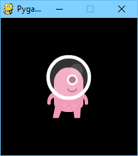
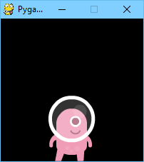

Wbudowane obiekty
=================

Pygame Zero dostarcza użytecznych obiektów wbudowanych,
które ułatwią Ci tworzenie gier.

.. _screen:

Ekran
-----

.. toctree::
    :hidden:

    ptext

Obiekt ``screen`` (*„ekran”*) reprezentuje ekran Twojej gry.

To cienka warstwa wokół obiektu *powierzchni* z biblioteki Pygame,
która pozwala łatwo rysować obrazki na ekranie („blitować” je).

.. class:: Screen

    .. attribute:: surface

        Surowy `obiekt powierzchni z Pygame`_ reprezentujący bufor ekranu.
        Możesz używać go do zaawansowanych operacji graficznych.

        .. _`obiekt powierzchni z Pygame`: https://www.pygame.org/docs/ref/surface.html

    .. method:: bounds()

        .. versionadded:: 1.3

        Zwraca obiekt ZRect reprezentujący granice ekranu.

    .. method:: clear()

        Czyści ekran do czerni.

    .. method:: fill((red, green, blue), [gcolor=(r, g, b)])

        Wypełnia ekran jednolitym kolorem,
        określonym jako zestaw (czerwony, zielony, niebieski).

        .. versionadded:: 1.3

            Jeśli podano argument ``gcolor``, ekran zostaje wypełniony gradientem
            od koloru z pierwszego parametru na górze, do koloru ``gcolor`` na dole.

    .. method:: blit(image, (left, top))

        Rysuje obraz na ekranie w podanym miejscu.

        ``blit()`` może przyjąć jako parametr ``image`` albo obiekt
        typu ``Surface``, albo napis. Jeśli ``image`` jest napisem,
        obraz o podanej nazwie zostanie załadowany z katalogu
        ``images/``.

    .. method:: draw.line(start, end, (r, g, b), width=1)

        Rysuje linię od pozycji ``start`` do pozycji ``end``
        o podanej szerokości (``width``).

    .. method:: draw.circle(pos, radius, (r, g, b), width=1)

        Rysuje okrąg podaną grubością linii.

    .. method:: draw.filled_circle(pos, radius, (r, g, b))

        Rysuje koło.

    .. method:: draw.rect(rect, (r, g, b), width=1)

        Rysuje obrys prostokąta podaną grubością linii.

        Jako pierwszy parametr przyjmuje obiekt :ref:`Rect <rect>`.

    .. method:: draw.filled_rect(rect, (r, g, b))

        Rysuje wypełniony prostokąt.

    .. method:: draw.text(text, [pos], **kwargs)

        Wypisuje tekst.

        Istnieje bardzo bogate API służące do pozycjonowania i formatowania
        tekstu; zobacz szczegóły w rozdziale :doc:`ptext`.

    .. method:: draw.textbox(text, rect, **kwargs)

        Wypisuje tekst o wielkości dostosowanej, by wypełnić dany prostokąt (:ref:`Rect`).

        Istnieje bardzo bogate API służące do formatowania
        tekstu; zobacz szczegóły w rozdziale :doc:`ptext`.

.. tip::

   Wszystkie kolory mogą być określane jako zestawy ``(r, g, b)``
   (czerwony, zielony, niebieski), albo przez nazwę, używając
   jednej z :doc:`nazw kolorów w Pygame<colors_ref>`.

.. _rect:

Rect (prostokąt)
----------------

Klasa `Rect z Pygame`_ jest dostępna jako wbudowana. Można jej używać na różne
sposoby, od wykrywania klików w danym regionie, po rysowanie prostokątów na ekranie.

Na przykład, możesz narysować prostokąt w taki sposób::

    CZERWONY = 200, 0, 0
    PROSTOKĄT = Rect((20, 20), (100, 100))

    def draw():
        screen.draw.rect(PROSTOKĄT, CZERWONY)

.. _`Rect z Pygame`: https://www.pygame.org/docs/ref/rect.html

Ładowanie zasobów
-----------------

Obiekty ``images`` i ``sounds`` służą do ładowania obrazów i dźwięków z plików
zapisanych, odpowiednio, w katalogach ``images`` i ``sounds``.
Pygame Zero obsłuży ładowanie tych zasobów na żądanie i zachowa je,
unikając zbędnego wielokrotnego ładowania ich.

Twoje obrazy muszą mieć nazwy złożone tylko z małych liter,
cyfr i znaków podkreślenia. Muszą też zaczynać się od litery.

Nazwy plików, które będą dobrze działy z mechanizmem ładowania zasobów::

    alien.png
    alien_hurt.png
    żółw_numer_7.png

A takie nie zadziałają::

    3.png
    3stopnie.png
    moj-kot.png
    pies george'a.png

Mechanizm ładowania zasobów zachowuje załadowane obrazy i dźwięki
w pamięci podręcznej (*cache*). Aby opróżnić tę pamięć (np. z powodu problemów
z pamięcią), użyj funkcji `unload()` i `unload_all()`.

Przykład::

    krowa = Actor('krowa')
    loader.images.unload('krowa')  # usuwa obraz krowa.png z pamięci podręcznej
    loader.images.unload_all()     # usuwa wszystkie obrazy z pamięci podręcznej

Obrazy
''''''

Pygame Zero potrafi ładować obrazy w formatach ``.png``, ``.gif``, i ``.jpg``.
Zalecamy format PNG: obsługuje wysokiej jakości obrazy z przezroczystością.

Potrzebujemy się upewnić, że katalog ``images`` istnieje.
Jeśli Twój projekt zawiera następujące pliki::

    kosmiczna_gra.py
    images/kosmita.png

To ``kosmiczna_gra.py`` może narysować duszka 'alien' na ekranie za pomocą
tego kodu::

    def draw():
        screen.clear()
        screen.blit('kosmita', (10, 10))

Nazwa przekazana do funkcji ``blit()`` to nazwa pliku obrazu w katalogu ``images``,
bez rozszerzenia pliku.

Albo, używając API :ref:`aktora <actor>`::

    kosmita = Actor('kosmita')

    def draw():
        kosmita.draw()

W obu przypadkach są pewne ograniczenia narzucone nazwom plików: mogą zawierać tylko
małe litery łacińskie, cyfry i znaki podreślenia. Służy to uniknięciu
problemów z kompatybilnością, gdy Twoja gra będzie używana pod innym systemem
operacyjnym, który inaczej traktuje wielkość liter w nazwach plików.

Powierzchnie obrazów
''''''''''''''''''''

Możesz także ładować obrazy z katalogu ``images`` używając obiektu ``images``.
Dzięki temu możesz pracować bezpośrednio z danymi obrazów, pobierać
ich rozmiary itp.::

    las = []
    for i in range(5):
        las.append(
            Actor('drzewo', topleft=(images.drzewo.get_width() * i, 0))
        )

Każdy załadowany obraz jest obiektem ``Surface`` (*„powierzchnia”*) Pygame.
Zazwyczaj będziesz używać metody ``screen.blit(...)`` do rysowania tych obrazów
na ekranie. Obiekt ten dostarcza dostarcza również przydatnych metod pozwalających
zbadać rozmiar obrazu w pikselach:

.. class:: Surface

    .. method:: get_width()

        Zwraca szerokość obrazu w pikselach.

    .. method:: get_height()

        Zwraca wysokość obrazu w pikselach.

    .. method:: get_size()

        Zwraca zestaw (krotkę) ``(wysokość, szerokość)`` oznaczającą
        rozmiar powierzchni w pikselach.

    .. method:: get_rect()

        Zwraca obiekt :class:`Rect` z oznaczonymi granicami obrazu przy założeniu
        że obraz byłby zlokalizowany w punkcie (0, 0).

        Efektywnie, jest to równoważne z::

            Rect((0, 0), obraz.get_size())

Dźwięki
'''''''

Pygame Zero może wczytywać dźwięki w formatach ``.wav`` i ``.ogg``.
WAV jest świetny do małych efektów dźwiękowych, podczas gdy OGG to skompresowany
format bardziej przystosowany do muzyki. W sieci możesz znaleźć
pliki .ogg i .wav dostępne do swobodnego użycia, które możesz wykorzystać
w swojej grze.

Potrzebujemy się upewnić, że katalog ``sounds`` istnieje.
Jeśli Twój projekt zawiera następujące pliki::

    perkusja.py
    sounds/werbel.wav

To ``perkusja.py`` może zagrać dźwięk werbla przy każdym naciśnięciu
przycisku myszy, używając tego kodu::

    def on_mouse_down():
        sounds.werbel.play()

Każdy załadowany dźwięk to obiekt ``Sound`` z Pygame, i ma różne metody
pozwalające odtwarzać i zatrzymywać dźwięk, oraz badać jego długość w sekundach:

.. class:: Sound

    .. method:: play()
        :noindex:

        Odtwarza dźwięk.

    .. method:: play(loops)

        Otrwarza dźwięk, zapętlając go podaną liczbę razy.

        :param loops: Liczba pętli zapętlonego dźwięku. Jeśli przekażesz ``-1``
                      jako liczbę pętli, dźwięk będzie się odtwarzał bez końca
                      (albo dopóki nie wywołasz metody :meth:`.Sound.stop()`).

    .. method:: stop()

        Zatrzymuje odtwarzanie dźwięku.

    .. method:: get_length()

        Zwraca długość dźwięku w sekundach.

Staraj się unikać używania obiektu ``sounds`` do odtwarzania dłuższych fragmentów muzyki.
Ponieważ system dźwięków ładuje całą muzykę do pamięci przed odtworzeniem jej,
może to powodować nadmierne zużycie pamięci, i opóźnienie odtwarzania o czas ładowania
muzyki.

.. _music:

Muzyka
------

.. versionadded:: 1.1

.. warning::

    API muzyki jest eksperymentalne i może być źródłem problemów
    z kompatybilnością między różnymi platformami.

    W szczególności:

    * Obsługa formatu MP3 może nie być dostępna w niektórych dystrybucjach Linuksa.
    * Wygląda na to, że niektóre pliki OGG Vorbis zawieszają Pygame
      ze 100-procentowym zużyciem procesura.

    W przypadku tego ostatniego problemu, można go rozwiązać przez
    przekodowanie pliku (być może innym enkoderem).

Wbudowany obiekt o nazwie ``music`` pozwala odtwarzać muzykę z katalogu
``music/`` (obok Twoich katalogów ``images/`` i ``sounds/``,
jeśli je masz). System muzyki będzie ładował ścieżkę muzyczną po trochu w trakcie
jej odtwarzania, unikając problemów z używaniem obiektu ``sounds`` do
odtwarzania dłuższych ścieżek.

Inną różnicą w stosunku do systemu dźwięków jest to, że tylko jedna ścieżka muzyki
może być odtwarzana jednocześnie. Jeśli zaczniesz odtwarzać inną ścieżkę,
ścieżka odtwarzana poprzednio zostanie zatrzymana.

.. function:: music.play(name)

    Odtwarza ścieżkę muzyczną ze wskazanego pliku.
    Ścieżka będzie zapętlona bez końca.

    Zastępuje to aktualnie odtwarzaną ścieżkę i anuluje wszelkie ścieżki
    umieszczone w kolejce przez wywołanie ``queue()``.

    Nie musisz dodawać rozszerzenia nazwy pliku ścieżki; na przykład, by
    odtworzyć plik ``mozart.mp3`` w pętli::

        music.play('mozart')

.. function:: music.play_once(name)

    Podobnie do ``play()``, ale muzyka zostanie zatrzymana po pojedynczym odtworzeniu.

.. function:: music.queue(name)

    Podobnie do ``play_once()``, ale zamiast zatrzymywać aktualnie odtwarzaną
    muykę, ścieżka zostanie dodana do kolejki do odtworzenia, gdy aktualnie odtwarzana
    ścieżka skończy się (i po wszystkich innych ścieżkach już wcześniej umieszczonych
    w kolejce).

.. function:: music.stop()

    Zatrzumuje muzykę.

.. function:: music.pause()

    Przerywa muzykę tymczasowo. Można ją wznowić, wywołując ``unpause()``.

.. function:: music.unpause()

    Wznawia odtwarzanie muzyki.

.. function:: music.is_playing()

    Zwraca ``True`` jeśli muzyka jest odtwarzana (i nie jest przerwana),
    ``False`` w przeciwnym przypadku.

.. function:: music.fadeout(duration)

    Wycisza, po czym zatrzymuje aktualnie odtwarzaną muzykę.

    :param duration: Czas trwania wyciszenia muzyki. Na przykład, by wyciszyć
                     muzykę w ciągu pół sekundy, wywołaj ``music.fadeout(0.5)``.

.. function:: music.set_volume(volume)

    Ustawia głośność systemu muzyki.

    Przyjmuje liczbę pomiędzy 0 (całkowita cisza) a 1 (pełna głośność).

.. function:: music.get_volume()

    Zwraca aktualną głośność systemu muzyki.

Po zaczęciu odtwarzania muzyki przy użyciu :func:`music.play_once()`, możesz
użyć :func:`haka on_music_end() <on_music_end>`, by zrobić coś kiedy muzyka
się skończy — na przykład, wylosować kolejną ścieżkę.

.. _clock:

Zegar
-----

Often when writing a game, you will want to schedule some game event to occur
at a later time. For example, we may want a big boss alien to appear after 60
seconds. Or perhaps a power-up will appear every 20 seconds.

More subtle are the situations when you want to delay some action for a shorter
period. For example you might have a laser weapon that takes 1 second to charge
up.

We can use the ``clock`` object to schedule a function to happen in the
future.

Let's start by defining a function ``fire_laser`` that we want to run in the
future::

    def fire_laser():
        lasers.append(player.pos)

Then when the fire button is pressed, we will ask the ``clock`` to call it for
us after exactly 1 second::

    def on_mouse_down():
        clock.schedule(fire_laser, 1.0)

Note that ``fire_laser`` is the function itself; without parentheses, it is
not being called here! The clock will call it for us.

(It is a good habit to write out times in seconds with a decimal point, like
``1.0``. This makes it more obvious when you are reading it back, that you are
referring to a time value and not a count of things.)

``clock`` provides the following useful methods:

.. class:: Clock

    .. method:: schedule(callback, delay)

        Schedule `callback` to be called after the given delay.

        Repeated calls will schedule the callback repeatedly.

        :param callback: A callable that takes no arguments.
        :param delay: The delay, in seconds, before the function should be
                      called.

    .. method:: schedule_unique(callback, delay)

        Schedule `callback` to be called once after the given delay.

        If `callback` was already scheduled, cancel and reschedule it. This
        applies also if it was scheduled multiple times: after calling
        ``schedule_unique``, it will be scheduled exactly once.

        :param callback: A callable that takes no arguments.
        :param delay: The delay, in seconds, before the function should be
                      called.

    .. method:: schedule_interval(callback, interval)

        Schedule `callback` to be called repeatedly.

        :param callback: A callable that takes no arguments.
        :param interval: The interval in seconds between calls to `callback`.

    .. method:: unschedule(callback)

        Unschedule callback if it has been previously scheduled (either because
        it has been scheduled with ``schedule()`` and has not yet been called,
        or because it has been scheduled to repeat with
        ``schedule_interval()``.

Note that the Pygame Zero clock only holds weak references to each callback
you give it. It will not fire scheduled events if the objects and methods are
not referenced elsewhere. This can help prevent the clock keeping objects
alive and continuing to fire unexpectedly after they are otherwise dead.

The downside to the weak references is that you won't be able to schedule
lambdas or any other object that has been created purely to be scheduled. You
will have to keep a reference to the object.

.. _actor:

Actors
------

Once you have many images moving around in a game it can be convenient to have
something that holds in one place the image and where it is on screen. We'll
call each moving image on screen an ``Actor``. You can create an actor by supplying
at least an image name (from the images folder above). To draw the alien talked
about above::

    alien = Actor('alien', (50, 50))

    def draw():
        screen.clear()
        alien.draw()

You can move the actor around by setting its pos attribute in an update::

    def update():
        if keyboard.left:
            alien.x -= 1
        elif keyboard.right:
            alien.x += 1

And you may change the image used to draw the actor by setting its image
attribute to some new image name::

    alien.image = 'alien_hurt'

Actors have all the same attributes and methods as :ref:`Rect <rect>`,
including methods like `.colliderect()`__ which can be used to test whether
two actors have collided.

.. __: https://www.pygame.org/docs/ref/rect.html#pygame.Rect.colliderect

Positioning Actors
''''''''''''''''''

If you assign a new value to one of the position attributes then the actor will
be moved. For example::

    alien.right = WIDTH

will position the alien so its right-hand side is set to ``WIDTH``.

Similarly, you can also set the initial position of the actor in the
constructor, by passing one of these as a keyword argument: ``pos``,
``topleft``, ``topright``, ``bottomleft``, ``bottomright``, ``midtop``,
``midleft``, ``midright``, ``midbottom`` or ``center``:

.. image:: _static/actor/anchor_points.png

This can be done during creation or by assigning a pair of x, y co-ordinates.
For example::

    WIDTH = 200
    HEIGHT = 200

    alien = Actor('alien', center=(100,100))

    def draw():
        screen.clear()
        alien.draw()

Changing ``center=(100, 100)`` to ``midbottom=(100, 200)`` gives you:

If you don't specify an initial position, the actor will initially be
positioned in the top-left corner (equivalent to ``topleft=(0, 0)``).

.. _anchor:

Anchor point
''''''''''''

Actors have an "anchor position", which is a convenient way to position the
actor in the scene. By default, the anchor position is the center, so the
``.pos`` attribute refers to the center of the actor (and so do the ``x`` and
``y`` coordinates). It's common to want to set the anchor point to another
part of the sprite (perhaps the feet - so that you can easily set the Actor to
be "standing on" something)::

    alien = Actor('alien', anchor=('center', 'bottom'))
    spaceship = Actor('spaceship', anchor=(10, 50))

``anchor`` is specified as a tuple ``(xanchor, yanchor)``, where the values can
be floats or the strings ``left``, ``center``/``middle``, ``right``, ``top`` or
``bottom`` as appropriate.

.. _rotation:

Rotation
''''''''

.. versionadded:: 1.2

The ``.angle`` attribute of an Actor controls the rotation of the sprite, in
degrees, anticlockwise (counterclockwise).

The centre of rotation is the Actor's :ref:`anchor point <anchor>`.

Note that this will change the ``width`` and ``height`` of the Actor.

For example, to make an asteroid sprite spinning slowly anticlockwise in
space::

    asteroid = Actor('asteroid', center=(300, 300))

    def update():
        asteroid.angle += 1

To have it spin clockwise, we'd change ``update()`` to::

    def update():
        asteroid.angle -= 1

As a different example, we could make an actor ``ship`` always face the mouse
pointer. Because :meth:`~Actor.angle_to()` returns 0 for "right", the sprite we
use for "ship" should face right::

    ship = Actor('ship')

    def on_mouse_move(pos):
        ship.angle = ship.angle_to(pos)

.. image:: _static/rotation.svg
    :alt: Diagram showing how to set up sprites for rotation with angle_to()

Remember that angles loop round, so 0 degrees == 360 degrees == 720 degrees.
Likewise -180 degrees == 180 degrees.

Distance and angle to
'''''''''''''''''''''

.. versionadded:: 1.2

Actors have convenient methods for calculating their distance or angle to other
Actors or ``(x, y)`` coordinate pairs.

.. method:: Actor.distance_to(target)

    Return the distance from this actor's position to target, in pixels.

.. method:: Actor.angle_to(target)

    Return the angle from this actor's position to target, in degrees.

    This will return a number between -180 and 180 degrees. Right is 0 degrees
    and the angles increase going anticlockwise.

    Therefore:

    * Left is 180 degrees.
    * Up is 90 degrees.
    * Down is -90 degrees.

.. _transparency:

Transparency
''''''''''''

.. versionadded:: 1.3

In some cases it is useful to make an Actor object partially transparent. This
can be used to fade it in or out, or to indicate that it is "disabled".

The ``.opacity`` attribute of an Actor controls how transparent or opaque it
is.

* When an actor is not at all transparent, we say it is "opaque" and it has
  ``opacity`` of ``1.0``, and you can't see through it at all.
* When an actor is completely transparent, it has an ``opacity`` of ``0.0``.
  This will make it completely invisible.

To make an actor that is half-transparent (like a ghost), you could write::

    ghost = Actor('ghost')
    ghost.opacity = 0.5

This diagram shows the scale; the grey checkerboard is used to give the sense
of transparency:

.. image:: _static/opacity.svg
    :alt: The opacity scale in Pygame Zero.

.. tip::

    The order in which you draw overlapping transparent objects still matters.
    A ghost seen through a window looks slightly different to a window seen
    through a ghost.

The Keyboard
------------

You probably noticed that we used the ``keyboard`` in the above code.
If you'd like to know what keys are pressed on the keyboard, you can query the
attributes of the ``keyboard`` builtin. If, say, the left arrow is held down,
then ``keyboard.left`` will be ``True``, otherwise it will be ``False``.

There are attributes for every key; some examples::

    keyboard.a  # The 'A' key
    keyboard.left  # The left arrow key
    keyboard.rshift  # The right shift key
    keyboard.kp0  # The '0' key on the keypad
    keyboard.k_0  # The main '0' key

The full set of key constants is given in the `Buttons and Keys`_
documentation, but the attributes are lowercase, because these are variables
not constants.

.. deprecated:: 1.1

    Uppercase and prefixed attribute names (eg. ``keyboard.LEFT`` or
    ``keyboard.K_a``) are now deprecated; use lowercase attribute names
    instead.

.. _`Buttons and Keys`: hooks.html#buttons-and-keys

.. versionadded:: 1.1

    You can now also query the state of the keys using the keyboard constants
    themselves::

        keyboard[keys.A]  # True if the 'A' key is pressed
        keyboard[keys.SPACE]  # True if the space bar is pressed

Animations
----------

You can animate most things in pygame using the builtin ``animate()``. For
example, to move an :ref:`Actor <actor>` from its current position on the
screen to the position ``(100, 100)``::

    animate(alien, pos=(100, 100))

.. function:: animate(object, tween='linear', duration=1, on_finished=None, **targets)

    Animate the attributes on object from their current value to that
    specified in the targets keywords.

    :param tween: The type of *tweening* to use.
    :param duration: The duration of the animation, in seconds.
    :param on_finished: Function called when the animation finishes.
    :param targets: The target values for the attributes to animate.

The tween argument can be one of the following:

+--------------------+------------------------------------------------------+----------------------------------------+
| 'linear'           | Animate at a constant speed from start to finish     | .. image:: images/linear.png           |
+--------------------+------------------------------------------------------+----------------------------------------+
| 'accelerate'       | Start slower and accelerate to finish                | .. image:: images/accelerate.png       |
+--------------------+------------------------------------------------------+----------------------------------------+
| 'decelerate'       | Start fast and decelerate to finish                  | .. image:: images/decelerate.png       |
+--------------------+------------------------------------------------------+----------------------------------------+
| 'accel_decel'      | Accelerate to mid point and decelerate to finish     | .. image:: images/accel_decel.png      |
+--------------------+------------------------------------------------------+----------------------------------------+
| 'in_elastic'       | Give a little wobble at the end                      | .. image:: images/in_elastic.png       |
+--------------------+------------------------------------------------------+----------------------------------------+
| 'out_elastic'      | Have a little wobble at the start                    | .. image:: images/out_elastic.png      |
+--------------------+------------------------------------------------------+----------------------------------------+
| 'in_out_elastic'   | Have a wobble at both ends                           | .. image:: images/in_out_elastic.png   |
+--------------------+------------------------------------------------------+----------------------------------------+
| 'bounce_end'       | Accelerate to the finish and bounce there            | .. image:: images/bounce_end.png       |
+--------------------+------------------------------------------------------+----------------------------------------+
| 'bounce_start'     | Bounce at the start                                  | .. image:: images/bounce_start.png     |
+--------------------+------------------------------------------------------+----------------------------------------+
| 'bounce_start_end' | Bounce at both ends                                  | .. image:: images/bounce_start_end.png |
+--------------------+------------------------------------------------------+----------------------------------------+

The ``animate()`` function returns an ``Animation`` instance:

.. class:: Animation

    .. method:: stop(complete=False)

        Stop the animation, optionally completing the transition to the final
        property values.

        :param complete: Set the animated attribute to the target value.

    .. attribute:: running

        This will be True if the animation is running. It will be False
        when the duration has run or the ``stop()`` method was called before
        then.

    .. attribute:: on_finished

        You may set this attribute to a function which will be called
        when the animation duration runs out. The ``on_finished`` argument
        to ``animate()`` also sets this attribute. It is not called when
        ``stop()`` is called. This function takes no arguments.

Tone Generator
--------------

.. versionadded:: 1.2

Pygame Zero can play tones using a built-in synthesizer.

.. function:: tone.play(pitch, duration)

    Play a note at the given pitch for the given duration.

    Duration is in seconds.

    The `pitch` can be specified as a number in which case it is the frequency
    of the note in hertz.

    Alternatively, the pitch can be specified as a string representing a note
    name and octave. For example:

    * ``'E4'`` would be E in octave 4.
    * ``'A#5'`` would be A-sharp in octave 5.
    * ``'Bb3'`` would be B-flat in octave 3.

Creating notes, particularly long notes, takes time - up to several
milliseconds. You can create your notes ahead of time so that this doesn't slow
your game down while it is running:

.. function:: tone.create(pitch, duration)

    Create and return a Sound object.

    The arguments are as for play(), above.

This could be used in a Pygame Zero program like this::

    beep = tone.create('A3', 0.5)

    def on_mouse_down():
        beep.play()

.. _data-storage:

Data Storage
------------

The ``storage`` object behaves just like a Python dictionary but its contents
are preserved across game sessions. The values you assign to storage will be
saved as JSON_, which means you can only store certain types of objects in it:
``list``/``tuple``, ``dict``, ``str``, ``float``/``int``, ``bool``, and
``None``.

.. _JSON: https://en.wikipedia.org/wiki/JSON

The ``storage`` for a game is initially empty. Your code will need to handle
the case that values are loaded as well as the case that no values are found.

A tip is to use ``setdefault()``, which inserts a default if there is no value
for the key, but does nothing if there is.

For example, we could write::

    storage.setdefault('highscore', 0)

After this line is executed, ``storage['highscore']`` will contain a value -
``0`` if there was no value loaded, or the loaded value otherwise. You could
add all of your ``setdefault`` lines towards the top of your game, before
anything else looks at ``storage``::

    storage.setdefault('level', 1)
    storage.setdefault('player_name', 'Anonymous')
    storage.setdefault('inventory', [])

Now, during gameplay we can update some values::

    if player.colliderect(mushroom):
        score += 5
        if score > storage['highscore']:
            storage['highscore'] = score

You can read them back at any time::

    def draw():
        ...
        screen.draw.text('Highscore: ' + storage['highscore'], ...)

...and of course, they'll be preserved when the game next launches.

These are some of the most useful methods of ``storage``:

.. class:: Storage(dict)

    .. method:: storage[key] = value

        Set a value in the storage.

    .. method:: storage[key]

        Get a value from the storage. Raise KeyError if there is no such key
        in the storage.

    .. method:: setdefault(key, default)

        Insert a default value into the storage, only if no value already
        exists for this key.

    .. method:: get(key, default=None)

        Get a value from the storage. If there is no such key, return default,
        or None if no default was given.

    .. method:: clear()

        Remove all stored values. Use this if you get into a bad state.

    .. method:: save()

        Saves the data to disk now. You don't usually need to call this, unless
        you're planning on using ``load()`` to reload a checkpoint, for
        example.

    .. method:: load()

        Reload the contents of the storage with data from the save file. This
        will replace any existing data in the storage.

    .. attribute:: path

        The actual path to which the save data will be written.

.. caution::

    As you make changes to your game, ``storage`` could contain values that
    don't work with your current code. You can either check for this, or call
    ``.clear()`` to remove all old values, or delete the save game file.

.. tip::

    Remember to check that your game still works if the storage is empty!
