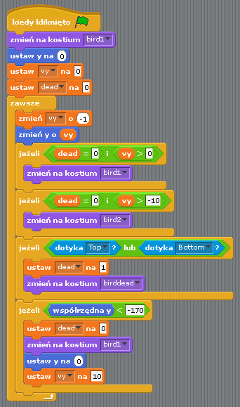

Przejście ze Scratcha
=====================

Ten przewodnik porównuje implementację gry Flappy Bird napisaną w Scratchu
i napisaną w Pygame Zero. Programy w Scratchu i Pygame Zero są podobne
w zadziwiającym stopniu.

`Wersję w Pygame Zero`__ można znaleźć w repozytorium Pygame Zero.

.. __: https://github.com/lordmauve/pgzero/blob/master/examples/flappybird/flappybird.py

Z repozytorium możesz też pobrać `wersję w Scratchu 1.4`__ i `wersję w Scratchu 3`__.

.. __: https://github.com/lordmauve/pgzero/raw/master/examples/flappybird/Flappy%20Bird.sb
.. __: https://github.com/lordmauve/pgzero/raw/master/examples/flappybird/Flappy%20Bird.sb3

Wersja w Pygame Zero zawiera mechanizm punktacji, którą pomijamy w przykładach
kodu na tej stronie, by porównanie było bliższe.

Pokazany niżej kod w Pythonie został przeorganizowany dla większej jasności przykładów.

Scena
-----

Tak wygląda scena w naszym programie w Scratchu:

Są tu tylko trzy obiekty, oprócz tła: ptak i dwie rury, górna i dolna.

W kodzie w Pygame Zero odpowiadają im definicje obiektów ``Aktorów``::

   bird = Actor('bird1', (75, 200))
   pipe_top = Actor('top', anchor=('left', 'bottom'))
   pipe_bottom = Actor('bottom', anchor=('left', 'top'))

W Pygame Zero musimy też zapewnić rysowanie tych obiektów. Co do zasaday daje to nieco więcej
elastyczności przy rysowaniu sceny::

   def draw():
       screen.blit('background', (0, 0))
       pipe_top.draw()
       pipe_bottom.draw()
       bird.draw()

Ruch rur
--------

Rury przesuwają się w stałym tempie niezależnie od ptaka. Kiedy chowają się
za lewą krawędzią ekranu, pojawiają się znowu z prawej, a ich pozycja w pionie
zmienia się losowo.

W Scratchu osiągamy to tworząc dwa osobne skrypty dla górnej i dolnej rury.

Podsumowując, co tu się dzieje:

* Warunek ``współrzędna x < -240`` jest spełniony, gdy rura chowa się za lewą
  krawędzią ekranu — to sygnał do zresetowania położenia rur.
* Zmienna ``pipe_height`` służy do koordynacji obu rur. Ponieważ przerwa między
  rurami powinna pozostać stała, nie możemy wybrać losowo położenia *obu* rur.
  Dlatego jeden ze skryptów ma ten mechanizm, a drugi nie.
* Instrukcja ``ustaw y na pipe height +/- 230`` ustawia jedną rurę nad
  ``pipe_height``, a drugą rurę pod ``pipe_height``.

Ten kod staje się znacznie prostszy w Pygame Zero. Możemy napisać jedną funkcję,
która aktualizuje obie rury. Faktycznie dzielę ją w inny sposób, by było jasno
widać, że akcje resetowania zachodzą razem::

   import random

   WIDTH = 400
   HEIGHT = 708
   GAP = 130
   SPEED = 3

   def reset_pipes():
       pipe_gap_y = random.randint(200, HEIGHT - 200)
       pipe_top.pos = (WIDTH, pipe_gap_y - GAP // 2)
       pipe_bottom.pos = (WIDTH, pipe_gap_y + GAP // 2)

   def update_pipes():
       pipe_top.left -= SPEED
       pipe_bottom.left -= SPEED
       if pipe_top.right < 0:
           reset_pipes()

Drobna różnica jest taka, że wartości, których chcę użyć wiele razy, mogę zdefiniować
jako „stałe”, zapisywane DUŻYMI LITERAMI. Pozwala mi to zmieniać je w jednym miejscu,
gdy chcę inaczej wyregulować grę. Na przykład, w kodzie powyżej, mogę rozszerzyć albo
zwęzić przerwę między rurami, po prostu zmieniając wartość ``GAP``.

Największa różnica jest taka, że w kodzie w Pythonie nie ma żadnej pętli typu „zawsze”.
To jest duża różnica między Scratchem a większością tekstowych języków programowania:
musisz zaktualizować grę o jeden krok animacji i wyjść z funkcji. Wyjście z funkcji
daje Pygame Zero szansę na zajęcie się rzeczami takimi jak obsługa wejść albo rysowanie
zawartości ekranu. Wieczna pętla sprawiłaby, że gra po prostu by się zatrzymała,
więc wszelkie pętle muszą się kończyć szybko.

Pygame Zero wywołuje funkcję ``update()`` kiedy przychodzi czas zaktualizować animację
o jeden krok, musimy więc tylko dodać wywołanie funkcji ``update_pipes()``::

   def update():
      update_pipes()

Ptak
----

Wyżej opisany schemat tego jak logika Scratcha przekłada się na kod Pythona
pasuje też do logiki ptaka. Tym razem najpierw obejrzyjmy kod w Pythonie.

Kod aktualizujący ptaka jest zorganizowany w funkcji o nazwie
``update_bird()``. Pierwsza rzecz w tej funkcji to kod przesuwający ptaka
zgodnie z prawem grawitacji::

   GRAVITY = 0.3

   # Początkowy stan ptaka
   bird.dead = False
   bird.vy = 0

   def update_bird():
       uy = bird.vy
       bird.vy += GRAVITY
       bird.y += bird.vy
       bird.x = 75

To bardzo prosty wzór na grawitację:

* Grawitacja oznacza stałe **przyspieszenie w dół**.
* Przyspieszenie to zmiana **prędkości**.
* Prędkość to zmiana **pozycji**.

Aby to przedstawić, potrzebujemy śledzić zmienną ``bird.vy``, która oznacza prędkość
ptaka w kierunku ``y`` (``v`` to oznaczenie prędkości, ``y`` to kierunek pionowy).
To jest nowa zmienna, którą sami definiujemy, a nie coś
dostarczonego nam przez Pygame Zero.

* Grawitacja oznacza stałe przyspieszenie w dół: stała ``GRAVITY`` jest większa niż 0.
* Przyspieszenie to zmiana prędkości: stałą ``GRAVITY`` dodajemy do ``bird.vy``
* Prędkość to zmiana pozycji: zmienną ``bird.vy`` dodajemy do ``bird.y``

Zwróć uwagę, że ptak nie porusza się w poziomie! Jego pozycja ``x`` ma wartość
75 w ciągu całej gry. Symulujemy ruch przesuwając rury w kierunku ptaka.
Wygląda to, jak gdyby kamera poruszała się razem z ptakiem. Dlatego nie potrzebujemy
zmiennej ``vx`` w tej grze.

Następna sekcja sprawia, że ptak macha skrzydłami::

       if not bird.dead:
           if bird.vy < -3:
               bird.image = 'bird2'
           else:
               bird.image = 'bird1'

Sprawdzamy tutaj, czy ptak porusza się w górę, czy w dół. Pokazujemy obraz ``bird2``,
gdy porusza się w górę, a obraz ``bird1`` w przeciwnym przypadku (wartość -3 została
dobrana metodą prób i błędów, by uzyskać przekonujący wygląd).

Kolejna sekcja sprawdza, czy ptak zderzył się ze ścianą::

       if bird.colliderect(pipe_top) or bird.colliderect(pipe_bottom):
           bird.dead = True
           bird.image = 'birddead'

Jeśli tak, to ustawiamy ``bird.dead`` na ``True``. To jest **wartość logiczna**, czyli
ma wartość albo ``True`` (prawda) albo ``False`` (fałsz). Dzięki niej możemy łatwo sprawdzać,
czy ptak jest żywy. Jeśli nie jest żywy, nie będzie reagował na sterowanie nim przez użytkownika.

Ostatnia sekcja sprawda, czy ptak wypadł poza dolną (albo górną) krawędź ekranu gry.
Gdy tak się stanie, ptak jest resetowany::

       if not 0 < bird.y < 720:
           bird.y = 200
           bird.dead = False
           bird.vy = 0
           reset_pipes()

Co tu robi ``reset_pipes()``? Ponieważ mój kod dotyczący rur znajduje się w osobnej funkcji,
mogę wywołać ją zawsze, gdy chcę zresetować moje ściany.
W tym przypadku poprawia to grę, bo daje graczowi szansę na reakcję, gdy ptak powróci do swojej
pozycji startowej.

I znowu, tę funkcję trzeba wywoływać przed każdą klatką, więc dodajemy ją do ``update()``::

   def update():
      update_pipes()
      update_bird()

Ostatnia część logiki ptaka to reagowanie na sterowanie nim przez gracza.
Kiedy naciskamy klawisz, ptak odpycha się w górę. Pygame Zero wywoła funkcję
``on_key_down()`` — jeśli taką zdefiniujesz — zawsze gdy zostanie wciścięty klawisz::

   FLAP_VELOCITY = -6.5

   def on_key_down():
       if not bird.dead:
           bird.vy = FLAP_VELOCITY

Tutaj, jeśli ptak nie jest martwy, ustawiamy jego ``vy`` na ujemną wartość:
w Pygame Zero oznacza to ruch w górę.

Powinno Ci być łatwo znaleźć dużo podobieństw między kodem w Pythonie a tym
kodem w Scratchu:

Największe różnice między Scratchem a Pygame Zero są takie:

* W Pygame Zero nie możesz tworzyć wiecznych pętli — uaktualniasz tylko stan
  dla kolejnej klatki i kończysz funkcję.
* Współrzędne są inne. W Pygame Zero, lewy górny róg ekranu to
  ``x = 0, y = 0``. Kierunek ``x`` idzie od lewej do prawej jak wcześniej, ale
  ``y`` idzie w dół ekranu! To dlatego w Pythonie ``GRAVITY`` jest liczbą dodatnią, a
  ``FLAP_VELOCITY`` — ujemną.
* ``bird.dead`` jest wartością logiczną, dlatego mogę pisać np. ``if not bird.dead``
  zamiast ``dead = 0`` jak w Scratchu.

Podsumowanie
------------

Wiele pojęć dostępnych w Scratchu da się przełożyć bezpośrednio do Pygame Zero.

Tutaj jest kilka porównań:

+----------------------------------+------------------------------------------------+
| W Scratchu                       | W Pygame Zero                                  |
+==================================+================================================+
| ``zmień y o 1`` (w górę)         | ``bird.y -= 1``                                |
+----------------------------------+------------------------------------------------+
| ``zmień y o -1`` (w dół)         | ``bird.y += 1``                                |
+----------------------------------+------------------------------------------------+
| ``zmień na kostium <name>``      | ``bird.image = 'name'``                        |
+----------------------------------+------------------------------------------------+
| ``jeżeli dead = 0``              | ``if not bird.dead:``                          |
+----------------------------------+------------------------------------------------+
| ``ustaw dead na 0``              | ``bird.dead = False``                          |
+----------------------------------+------------------------------------------------+
| ``jeżeli dotyka Top?``           | ``if bird.colliderect(pipe_top)``              |
+----------------------------------+------------------------------------------------+
| ``kiedy kliknięto Flagę``…       | Umieść kod w funkcji ``update()``.             |
| ``zawsze``                       |                                                |
+----------------------------------+------------------------------------------------+
| ``kiedy klawisz […] naciśnięty`` | ``def on_key_down():``                         |
+----------------------------------+------------------------------------------------+
| ``losuj liczbę pomiędzy A a B``  | ``import random`` by załadować moduł           |
|                                  | ``random``, następnie ``random.randint(A, B)`` |
+----------------------------------+------------------------------------------------+
| (0, 0) jest w środku sceny       | (0, 0) jest w lewym górnym roku okna           |
+----------------------------------+------------------------------------------------+

Kod w Pythonie bywa czasem prostszy, bo może być zorganizowany
w sposób pomagający go zrozumieć podczas czytaniu.

Dzięki mocy aktorów Pygame Zero także używanie współrzędnych jest łatwiejsze.
Użyliśmy ustawienia ``anchor``, by ustawiać pozycję rur, i mogliśmy
zobaczyć czy rura jest poza ekranem, sprawdzając czy ``pipe_top.right < 0``,
a nie ``if x position < -240``.

.. note::

   W polskiej wersji Scratcha komendy (nazwy bloków) są wyświetlane po polsku.
   W tekstowych językach programowania, takich jak Python, wszystkie standardowe
   nazwy są zazwyczaj po angielsku. Podobnie w Pygame Zero, wszystkie nazwy
   :doc:`wbudowanych obiektów <builtins>` i :doc:`funkcji haków <hooks>` są
   zawsze w języku angielskim.
